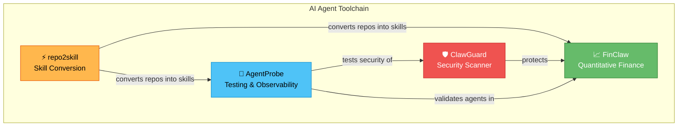

# Kang Zhou

**Principal Engineer @ Microsoft · Building AI Agent Security & Intelligence Tools**

---

I believe AI agents are the next platform shift — and they need **immune systems**, not just guardrails.  
My open-source work focuses on making AI agents safer, smarter, and more observable.

## 🔬 Project Ecosystem

## 🚀 Featured Projects

| | Project | Description | Tests | Install |
|---|---------|-------------|-------|---------|
| 🔬 | **[AgentProbe](https://github.com/NeuZhou/agentprobe)** v2.1.0 | Playwright for AI Agents — test, observe, and validate AI agent behavior | 781+ | `npm i agentprobe` |
| 🛡️ | **[ClawGuard](https://github.com/NeuZhou/clawguard)** | AI Agent Security Scanner — 287+ threat patterns, PII sanitizer, OWASP coverage | 287+ | `npm i @neuzhou/clawguard` |
| 📈 | **[FinClaw](https://github.com/NeuZhou/finclaw)** v2.1.0 | AI-Powered Quantitative Finance — 8 master strategies, US/CN/HK markets | 411+ | `pip install finclaw-ai` |
| ⚡ | **[repo2skill](https://github.com/NeuZhou/repo2skill)** v3.0.0 | Convert any GitHub repo into an AI agent skill in one command | 256+ | `npx repo2skill` |

> **1,735+ tests** across the ecosystem — because AI agents deserve battle-tested tools.

## 📊 GitHub Stats

## 🧠 Skills & Interests

- **AI Agent Security** — prompt injection, tool misuse detection, PII protection
- **AI Agent Testing** — behavioral testing, observability, regression detection
- **Quantitative Finance** — algorithmic trading, multi-market strategies, backtesting
- **Developer Tooling** — CLI tools, code generation, developer experience
- **Open Source** — building tools that make AI agents safer for everyone

## 🔗 Links

---

  <i>"Every claw needs a guard."</i> 🦀🛡️

